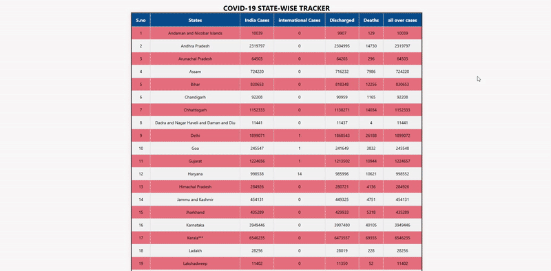

🦠 COVID-19 State-wise Tracker

📊 Overview

The COVID-19 State-wise Tracker is a responsive, real-time web application designed to track the spread and impact of the COVID-19 pandemic across different states in a given country (e.g., India, USA, etc.). The application provides users with up-to-date statistics such as confirmed cases, active cases, recovered patients, and death counts, broken down by each state. It serves as an essential tool for public awareness, policy planning, and educational purposes.

This tracker integrates dynamic data fetching from official APIs (such as disease.sh, covid19india.org, or WHO sources), and visualizes the data in a clean, user-friendly interface using charts, tables, and maps.

🌟 Key Features

✅ Real-time Data Fetching from trusted COVID-19 APIs

📍 State-wise Breakdown of COVID-19 data

📈 Visual Charts (bar graphs, line charts, pie charts) for trends and comparisons

🌍 Interactive Map Integration to visualize data geographically

🔍 Search and Filter Functionality to quickly find specific state data

📱 Responsive Design for both mobile and desktop users

🕒 Time-Series Analysis to view how case numbers have evolved over time

🌐 Multi-language Support (optional feature)

📤 Downloadable Reports (optional feature)

🧑‍💻 Technologies Used

Frontend: HTML5, CSS3, JavaScript, React.js / Vue.js / Angular (choose one)

Charting Library: Chart.js / D3.js / Recharts

Map Integration: Leaflet.js / Google Maps API

API Integration: RESTful API (e.g., covid19api.com, disease.sh, or local government sources)

Backend: Node.js / Firebase / Python Flask (if backend is used)

Deployment: GitHub Pages / Netlify / Vercel / Heroku

📽️ Demo Video

Note: Replace "your-video-id" with the actual YouTube video ID or embed your video if hosted elsewhere.

🚀 How It Works

The application fetches real-time COVID-19 statistics from a selected API upon load.

Users are presented with a summary dashboard showing total cases, recoveries, and deaths.

A state-wise table lists detailed figures, sortable by any column.

A dropdown or search bar allows users to select or find a specific state.

Interactive charts and maps visualize trends and regional spread.

Optional features like dark mode, downloadable reports, and notifications enhance usability.

📌 Use Cases

For citizens to stay informed about the COVID-19 situation in their area.

For healthcare professionals to assess resource needs.

For governments & policymakers to make data-driven decisions.

For educators and researchers to analyze trends and case studies.

📦 Future Enhancements

Vaccination statistics by state

Comparison graphs between states

Push notifications for updates

Integration with health advisories or testing centers

AI-based prediction models

